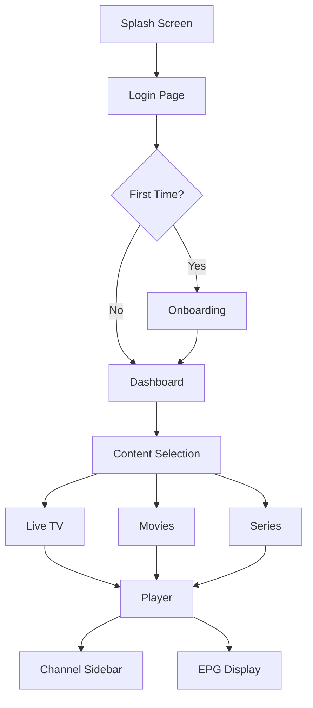

## 1. Product Overview
XPlayer - Premium desktop medya platformu. IPTV oynatıcıdan öte, Netflix tarzı lüks bir medya deneyimi sunar.

Kullanıcılar Xtream Codes veya M3U bağlantılarıyla canlı TV, film ve dizileri tek bir platformda izleyebilir. Gömülü mpv player ile video uygulama içinde oynatılır, harici pencere açılmaz.

## 2. Core Features

### 2.1 User Roles
| Role | Registration Method | Core Permissions |
|------|---------------------|------------------|
| Normal User | Xtream Codes veya M3U URL ile giriş | Tüm içerikleri izleyebilir, favori ekleyebilir, geçmiş görüntüleyebilir |

### 2.2 Feature Module
XPlayer masaüstü uygulaması aşağıdaki temel sayfalardan oluşur:

1. **Splash Screen**: Logo animasyonlu açılış ekranı
2. **Login Page**: Xtream Codes ve M3U bağlantı girişi
3. **Onboarding Page**: Kullanıcı tercihleri seçimi (tür, dil, izleme alışkanlığı)
4. **Dashboard**: Netflix tarzı kişiselleştirilmiş ana sayfa
5. **Live TV Page**: Canlı kanal listesi ve kategoriler
6. **Movies Page**: Film kataloğu ve kategoriler
7. **Series Page**: Dizi kataloğu, sezon ve bölümler
8. **Content Detail Page**: Film/dizi detayları, fragman, oyuncular
9. **Player Page**: Gömülü mpv video oynatıcı
10. **Favorites Page**: Favori içerikler listesi
11. **History Page**: Son izlenenler ve devam ettirme

### 2.3 Page Details
| Page Name | Module Name | Feature description |
|-----------|-------------|---------------------|
| Splash Screen | Logo Animation | 2 saniye süren XPlayer logo animasyonu, ardından login ekranına yönlendirme |
| Login Page | Connection Form | Xtream Codes (server URL, username, password) veya M3U URL girişi, bağlantı doğrulama, kimlik bilgilerini yerel depolama |
| Onboarding Page | Preference Selection | Tür seçimi (aksiyon, komedi, korku vb), canlı yayın tercihi (spor, haber), dil tercihi, izleme alışkanlığı, profil tipi seçimi |
| Dashboard | Hero Banner | Arkaplan blur efektli büyük banner, açıklama ve PLAY butonu |
| Dashboard | Personalized Rows | Senin için önerilenler, izlemeye devam et, sevdiğin türde filmler, popüler kanallar satırları |
| Live TV Page | Channel List | Kanal logoları, isimleri, kategori filtreleme, mini canlı önizleme (1 saniye gecikmeyle başlar) |
| Movies Page | Movie Grid | Poster grid düzeni, kategori filtreleme, hover'da büyüme ve altın glow efekti |
| Series Page | Series Catalog | Poster grid, sezon ve bölüm seçimi, izleme ilerlemesi takibi |
| Content Detail Page | Movie Info | Poster, açıklama, IMDb puanı, yaş sınırı, favori butonu, fragman oynatıcı |
| Content Detail Page | Cast List | Yatay oyuncu listesi, TMDB API'den veri çekme |
| Content Detail Page | Season Selection | Dizi için sezon ve bölüm seçimi, izleme durumu göstergesi |
| Player Page | Video Controls | Play/pause, seek, ses kontrolü, fullscreen, hızlı kanal değiştirme |
| Player Page | Audio & Subtitle | Ses parçası seçimi, altyazı seçimi, altyazı boyutu, gecikme ayarı |
| Player Page | Channel Sidebar | Sağdan açılan kanal listesi paneli, anında kanal geçişi |
| Player Page | EPG Display | Şu anki ve sıradaki program bilgisi, zaman çizelgesi |
| Favorites Page | Favorite List | Favorilere eklenen içeriklerin listesi, kaldırma işlevi |
| History Page | Watch History | Son izlenenler listesi, kaldığı yerden devam ettirme |

## 3. Core Process
Kullanıcı akışı aşağıdaki gibidir:

1. Uygulama açılır → Splash screen (2 saniye)
2. Login ekranı → Xtream Codes veya M3U bağlantısı girilir
3. Başarılı giriş → Veri çekilir ve cache'e alınır
4. İlk kurulum → Onboarding tercihleri seçilir (sadece ilk açılışta)
5. Dashboard → Kişiselleştirilmiş ana sayfa yüklenir
6. İçerik seçimi → Film/dizi/kanal detay sayfası
7. Oynatma → Gömülü player açılır

## 4. User Interface Design

### 4.1 Design Style
- **Ana Renkler**: Arkaplan #0b0b0f, Panel #121218, Altın ana #D4AF37, Altın vurgu #FFD700
- **Yazı Renkleri**: Ana yazı #EAEAEA, Pasif yazı #9A9A9A, Soluk yazı #6f6f6f, Hata #ff4d4f
- **Buton Stili**: Yuvarlak köşeler (18-22px), altın glow efektli hover durumu
- **Fontlar**: Başlıklar Playfair Display, Menü & UI Montserrat
- **Layout**: Kart bazlı düzen, hafif gradient arkaplanlar, vignette efektli kenarlar
- **Animasyonlar**: 200-300ms yumuşak geçişler, hover'da %115 büyüme

### 4.2 Page Design Overview
| Page Name | Module Name | UI Elements |
|-----------|-------------|-------------|
| Login Page | Glass Panel | Ortada cam efekti panel, arkada koyu sinematik arkaplan, altın XPlayer logo, parlama animasyonlu CONNECT butonu |
| Dashboard | Hero Banner | Blur arkaplan, büyük içerik görseli, açıklama metni, altın PLAY butonu |
| Dashboard | Content Rows | Netflix tarzı yatay kaydırılabilir satırlar, poster kartları, hover'da büyüme ve altın glow |
| Live TV | Channel Cards | Kanal logoları, hover'da mini canlı preview (1sn gecikme), altın kenar vurgusu |
| Movies | Movie Grid | Poster grid düzeni, kategori filtre butonları, hover animasyonları |
| Content Detail | Blur Backdrop | Bulanık arkaplan, poster sol tarafta, bilgiler sağda, fragman butonu |
| Player | Fullscreen Video | Tam ekran video, mouse hareketinde kontrol bar, sağdan kayan kanal paneli |

### 4.3 Responsiveness
Desktop-first tasarım yaklaşımı. Electron masaüstü uygulaması olduğu için sabit pencere boyutları optimize edilecek. Minimum 1280x720 çözünürlük desteği.

### 4.4 3D Scene Guidance
Uygulama 3D içerik içermez, ancak sinematik görsel efektler için:
- Ortam: Koyu sinema salonu hissiyatı
- Işıklandırma: Sıcak altın tonları, yumuşak gölgeler
- Kompozisyon: Derinlik hissi veren katmanlı arayüz
- Efektler: Hafif parıltılar, glow efektleri, vignette karartma