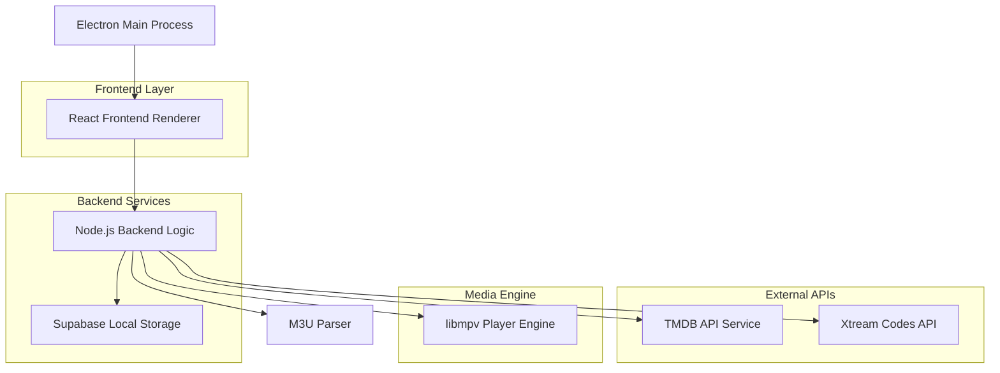
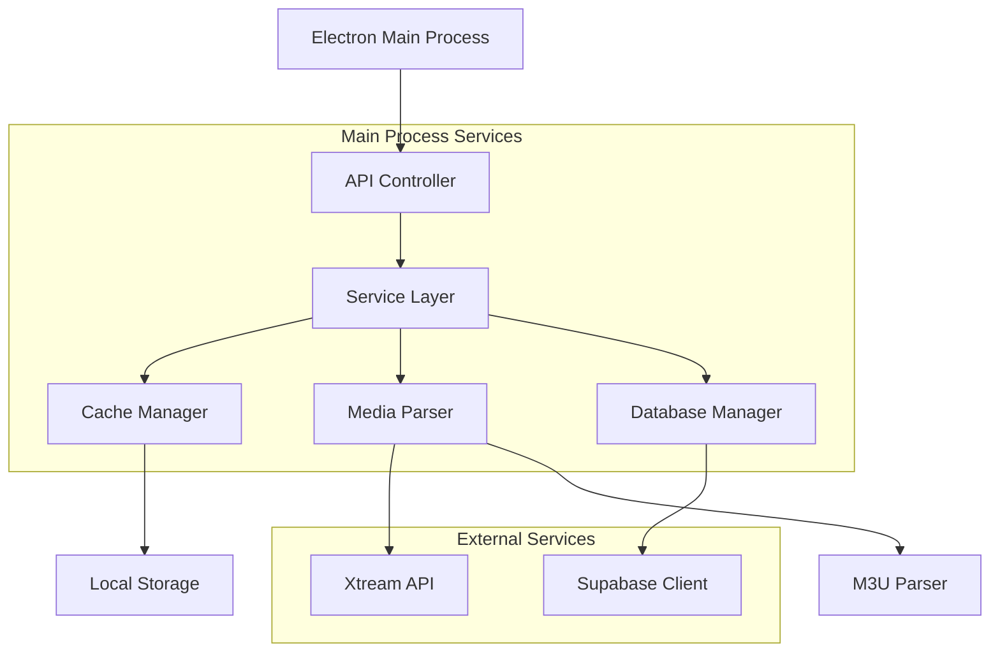
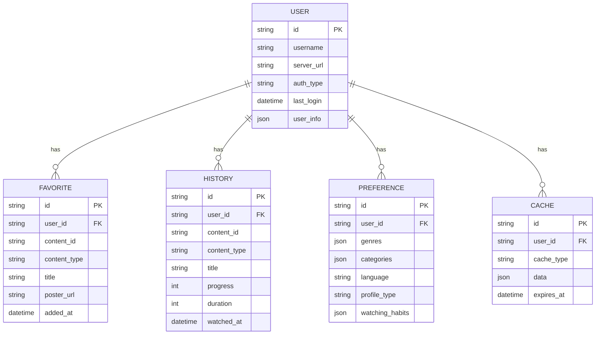

## 1. Architecture Design



## 2. Technology Description

* **Frontend**: React\@18 + TailwindCSS\@3 + Vite

* **Desktop Framework**: Electron\@27

* **Initialization Tool**: vite-init

* **Media Engine**: libmpv (mpv video engine)

* **Backend**: Node.js\@20 (Electron main process)

* **Local Storage**: Supabase (PostgreSQL for user data and caching)

* **External APIs**: TMDB API for movie metadata

## 3. Route Definitions

| Route             | Purpose                          |
| ----------------- | -------------------------------- |
| /splash           | Açılış animasyon ekranı          |
| /login            | Xtream Codes ve M3U giriş ekranı |
| /onboarding       | İlk kurulum tercihleri           |
| /dashboard        | Kişiselleştirilmiş ana sayfa     |
| /live-tv          | Canlı TV kanal listesi           |
| /movies           | Film kataloğu                    |
| /series           | Dizi kataloğu                    |
| /content/:id      | İçerik detay sayfası             |
| /player/:type/:id | Video oynatıcı                   |
| /favorites        | Favori içerikler                 |
| /history          | İzleme geçmişi                   |

## 4. API Definitions

### 4.1 Xtream Codes Authentication

```
POST /api/xtream/auth
```

Request:

| Param Name  | Param Type | isRequired | Description             |
| ----------- | ---------- | ---------- | ----------------------- |
| server\_url | string     | true       | Xtream Codes sunucu URL |
| username    | string     | true       | Kullanıcı adı           |
| password    | string     | true       | Şifre                   |

Response:

```json
{
  "status": "success",
  "user_info": {
    "username": "user123",
    "status": "Active",
    "exp_date": "2024-12-31",
    "is_trial": false
  },
  "server_info": {
    "url": "http://server.com",
    "port": "8080",
    "https_port": "8443"
  }
}
```

### 4.2 M3U Playlist Parse

```
POST /api/m3u/parse
```

Request:

| Param Name    | Param Type | isRequired | Description      |
| ------------- | ---------- | ---------- | ---------------- |
| playlist\_url | string     | true       | M3U playlist URL |

Response:

```json
{
  "status": "success",
  "channels": [
    {
      "id": "1",
      "name": "TRT 1 HD",
      "logo": "http://logo.url/trt1.png",
      "group": "Turkish",
      "url": "http://stream.url/trt1.m3u8"
    }
  ],
  "categories": ["Turkish", "Sports", "News"]
}
```

### 4.3 TMDB Metadata Fetch

```
GET /api/tmdb/metadata/:type/:id
```

Response:

```json
{
  "id": 12345,
  "title": "Movie Title",
  "overview": "Movie description...",
  "poster_path": "/path/to/poster.jpg",
  "backdrop_path": "/path/to/backdrop.jpg",
  "vote_average": 8.5,
  "release_date": "2024-01-15",
  "genres": ["Action", "Drama"],
  "cast": [
    {
      "name": "Actor Name",
      "character": "Character Name",
      "profile_path": "/path/to/profile.jpg"
    }
  ]
}
```

## 5. Server Architecture Diagram



## 6. Data Model

### 6.1 Data Model Definition



### 6.2 Data Definition Language

**User Table (users)**

```sql
-- create table
CREATE TABLE users (
    id UUID PRIMARY KEY DEFAULT gen_random_uuid(),
    username VARCHAR(255) NOT NULL,
    server_url VARCHAR(500),
    auth_type VARCHAR(50) CHECK (auth_type IN ('xtream', 'm3u')),
    user_info JSONB,
    last_login TIMESTAMP WITH TIME ZONE DEFAULT NOW(),
    created_at TIMESTAMP WITH TIME ZONE DEFAULT NOW(),
    updated_at TIMESTAMP WITH TIME ZONE DEFAULT NOW()
);

-- create indexes
CREATE INDEX idx_users_username ON users(username);
CREATE INDEX idx_users_last_login ON users(last_login DESC);
```

**Favorites Table (favorites)**

```sql
-- create table
CREATE TABLE favorites (
    id UUID PRIMARY KEY DEFAULT gen_random_uuid(),
    user_id UUID REFERENCES users(id) ON DELETE CASCADE,
    content_id VARCHAR(255) NOT NULL,
    content_type VARCHAR(50) CHECK (content_type IN ('movie', 'series', 'channel')),
    title VARCHAR(500) NOT NULL,
    poster_url VARCHAR(1000),
    added_at TIMESTAMP WITH TIME ZONE DEFAULT NOW()
);

-- create indexes
CREATE INDEX idx_favorites_user_id ON favorites(user_id);
CREATE INDEX idx_favorites_content_type ON favorites(content_type);
CREATE UNIQUE INDEX idx_favorites_user_content ON favorites(user_id, content_id);
```

**History Table (watch\_history)**

```sql
-- create table
CREATE TABLE watch_history (
    id UUID PRIMARY KEY DEFAULT gen_random_uuid(),
    user_id UUID REFERENCES users(id) ON DELETE CASCADE,
    content_id VARCHAR(255) NOT NULL,
    content_type VARCHAR(50) CHECK (content_type IN ('movie', 'series', 'channel')),
    title VARCHAR(500) NOT NULL,
    progress INTEGER DEFAULT 0,
    duration INTEGER DEFAULT 0,
    watched_at TIMESTAMP WITH TIME ZONE DEFAULT NOW()
);

-- create indexes
CREATE INDEX idx_history_user_id ON watch_history(user_id);
CREATE INDEX idx_history_watched_at ON watch_history(watched_at DESC);
CREATE UNIQUE INDEX idx_history_user_content ON watch_history(user_id, content_id);
```

**Preferences Table (user\_preferences)**

```sql
-- create table
CREATE TABLE user_preferences (
    id UUID PRIMARY KEY DEFAULT gen_random_uuid(),
    user_id UUID REFERENCES users(id) ON DELETE CASCADE,
    genres JSONB DEFAULT '[]',
    categories JSONB DEFAULT '[]',
    language VARCHAR(50) DEFAULT 'turkish',
    profile_type VARCHAR(50) DEFAULT 'general',
    watching_habits JSONB DEFAULT '{}',
    created_at TIMESTAMP WITH TIME ZONE DEFAULT NOW(),
    updated_at TIMESTAMP WITH TIME ZONE DEFAULT NOW()
);

-- create indexes
CREATE UNIQUE INDEX idx_preferences_user_id ON user_preferences(user_id);
```

**Cache Table (content\_cache)**

```sql
-- create table
CREATE TABLE content_cache (
    id UUID PRIMARY KEY DEFAULT gen_random_uuid(),
    user_id UUID REFERENCES users(id) ON DELETE CASCADE,
    cache_type VARCHAR(100) NOT NULL,
    data JSONB NOT NULL,
    expires_at TIMESTAMP WITH TIME ZONE,
    created_at TIMESTAMP WITH TIME ZONE DEFAULT NOW()
);

-- create indexes
CREATE INDEX idx_cache_user_id ON content_cache(user_id);
CREATE INDEX idx_cache_type ON content_cache(cache_type);
CREATE INDEX idx_cache_expires ON content_cache(expires_at);
```

**Supabase Row Level Security Policies**

```sql
-- Enable RLS
ALTER TABLE users ENABLE ROW LEVEL SECURITY;
ALTER TABLE favorites ENABLE ROW LEVEL SECURITY;
ALTER TABLE watch_history ENABLE ROW LEVEL SECURITY;
ALTER TABLE user_preferences ENABLE ROW LEVEL SECURITY;
ALTER TABLE content_cache ENABLE ROW LEVEL SECURITY;

-- Grant permissions
GRANT SELECT ON users TO anon;
GRANT ALL PRIVILEGES ON users TO authenticated;
GRANT ALL PRIVILEGES ON favorites TO authenticated;
GRANT ALL PRIVILEGES ON watch_history TO authenticated;
GRANT ALL PRIVILEGES ON user_preferences TO authenticated;
GRANT ALL PRIVILEGES ON content_cache TO authenticated;

-- RLS Policies
CREATE POLICY "Users can only see own data" ON users
    FOR ALL USING (auth.uid() = id);

CREATE POLICY "Users can manage own favorites" ON favorites
    FOR ALL USING (auth.uid() = user_id);

CREATE POLICY "Users can manage own history" ON watch_history
    FOR ALL USING (auth.uid() = user_id);

CREATE POLICY "Users can manage own preferences" ON user_preferences
    FOR ALL USING (auth.uid() = user_id);

CREATE POLICY "Users can manage own cache" ON content_cache
    FOR ALL USING (auth.uid() = user_id);
```

